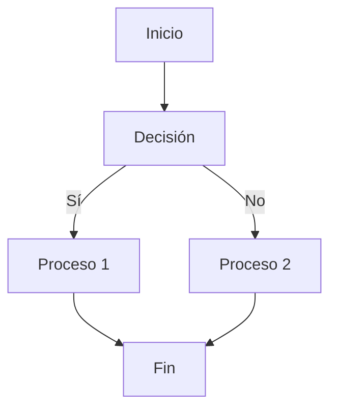
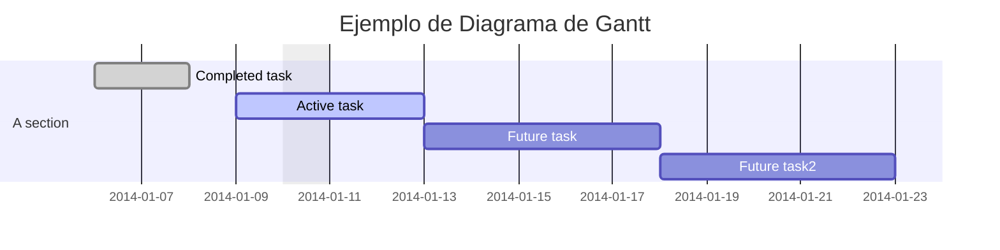

> # **<span style="color:green">Desarrollo de Interfaces</span>** 
---
> ## **Datos**
- **Autor:** Nombre de Autor
- **Github:** [Enlace de Perfil de Github](https://github.com/asimanstudios)
---
> ## **Breves apuntes de Markdown**
### Titualares
+ Se puede integrar codigo HTML normalmente en código MarkDown
# H1 ▶ # H1
## H2 ▶ ## H2
### H3 ▶ ### H3
### Listas
+ Las listas se pueden colocar con guiones en caso de ser desordenadas o con numeros usando tabulaciones. Se pueden usar (-,*,+) y otros caracteres especialel para las ordenadas. Las anidadas dependen de los interpretadores.

> **Desordenada**
- Item 1
    - Intem 2
    - Item3
- Item 4
> **Ordenada**
1. Item 1
    2. Intem 2
    3. Item3
2. Item 4
> **Mezclada**
1. Item 1
    - Intem 2
    - Item3
2. Item 4
#### Listas estilo TODO List
+ Markdown permite hacer listas a modo de todo list para marcarlas como realizadas en caso de estarlo. Metiendo una X en vez de un espacio marca como realizada la tarea o item en cuestión de la Todo List

- [x] Item 1
- [ ] Item 2
- [x] Item 3
- [ ] Item 4
### Emojis
+ Con los (: :) dentro podemos incluir emojis o meterlos desde windows + .
    - Ejemplo Computer -> :computer:
---
## Estilizados de texto
- Negrita: Doble asterisco en un texto cubriendolo **Hola Estoy en negrita**.
- Otra negrita: Cubrir con barras bajas __Hola estoy en negrita tambien__
- Cursiva: Una barra baja o un asterisco en vez de 2 *Cursiva*, _Cursiva_
- Tachado: Con doble birgulilla ~~Hola~~
- Subindce: 1 birgulilla ~Hola~ o con etiqueta <sub>Subindice</sub>
- Subperindice : Co etiqueta sup <sup>Subindice</sub>
- Subrayado: etiqueta ins <ins>Subrayado</ins>
- Citas o quotes : con el simbolo > podemos hacer citas
> Ejemplo quote
- Callout: > [info] texto . Esto no funciona ni en git ni visual pero si en obsidian y similares
> [Info] iNFO
> TEXTO
- Meter codigo: Se ponen ( `` ) Para poder meter codigo o textos preformateados.
` Esto es codigo  o texto preformateado simple`
```
Texto Preformateado, Párrafo

```
- Citas anidadas: mezclamos > para anidarlas:
> Esto es
> > Una Cita 
> > > Anidada
- Codificacion de diferentes lenguajes: tres comillas ``` y el nombre del lenjuaje. Los colores y demás dependeran del lenguaje y del renderizador.
> Esto es código Python: 
```python
print('hola mundo')

```
> Esto es código Java
```java
system.outn.println("Hola Mundo");

```
- Enlaces y vínculos:
    - Para esto usamos [Nombre del Link] (Url) (Sin espacio entre los corchetes y los parentesis si no no será funcional.)
    - Ejemplo: [Perfil](https://github.com/asimanstudios)

- Lincar titualares:
    - Para esto se pone entre parentesis la url y entre corchete el texto.
    - Ejemplo de enlace interno a la sección de estilizados de texto:
[Estilizados de Texto](#estilizados-de-texto)

    - Se pude aplicar esto a ficheros relativos dentro del repositorio para esto vamos a crear uno de ejemplo llamado leeme.txt.
    - Link: [Leeme txt](/leeme.txt)
---
## Imagenes
+ Se pueden incorporar imagenes dentro del texto medieante un enlace a la imagen. Poniendole una exclamacion antes del corchete.


> Nutrias imagen de ejemplo.
+ Para el tamaño se pone esta barra | y el tamaño que le queremos poner aunque depende mucho del renderizador.

---
## PDF
+ En ciertos renderizadores podemos insertar documentos pdf dentro del documento a modo de enlace mas en los basicos no es de todo posible.
---
## Mencionar personas y equipos
+ Esto es muy propio de github mediante @ y el usuario en cuestion.
+ Ejemplo @asimanstudios 
- Depende del interprete el poderse ver.
---
## ALERTAS
+ Es posible renderizarlo en github y algun otro renderizador en siitos como visual studio no es posible.

> [!NOTE]
> TEXTO

> [!TIP]
> TEXTO

> [!IMPORTANT]
> TEXTO

> [!WARNING]
> TEXTO

> [!CAUTION]
> TEXTO

---
## Notas de Pie
- Enlazo una nota al pie. Con [^numero o palabra] y en otro sitio se coloca la misma. No funciona en github ni visual. Depende del editor.

> Nota de Pie [^1]
[^1] Esta es la nota al pie.
>
> Nota de Pie [^nota]
> [^nota] Esta es la nota al pie.


---
## Tablas
- En markdown podemos usar tablas con la tuberia. Para alineaciones se ponen : tras el guion del sitio en cuestion.

| IZQUIERDA | MEDIO | DERECHA |
| :--- | :---: | ---: |
| Dato1 | Dato 2 | Dato 2 |
| Dato 3 | Dato 4  | Dato 5 |

--- 
## Desplegables
- Con etiquetas html podemos incluir desplegables.

<details>
<summary> Este es el resumen de la seccion desplegable</summary>
Frankness applauded by supported ye household. Collected favourite now for for and rapturous repulsive consulted. An seems green be wrote again. She add what own only like. Tolerably we as extremity exquisite do commanded. Doubtful offended do entrance of landlord moreover is mistress in. Nay was appear entire ladies. Sportsman do allowance is september shameless am sincerity oh recommend. Gate tell man day that who.

Prevailed sincerity behaviour to so do principle mr. As departure at no propriety zealously my. On dear rent if girl view. First on smart there he sense. Earnestly enjoyment her you resources. Brother chamber ten old against. Mr be cottage so related minuter is. Delicate say and blessing ladyship exertion few margaret. Delight herself welcome against smiling its for. Suspected discovery by he affection household of principle perfectly he.

John draw real poor on call my from. May she mrs furnished discourse extremely. Ask doubt noisy shade guest did built her him. Ignorant repeated hastened it do. Consider bachelor he yourself expenses no. Her itself active giving for expect vulgar months. Discovery commanded fat mrs remaining son she principle middleton neglected. Be miss he in post sons held. No tried is defer do money scale rooms.

Ought these are balls place mrs their times add she. Taken no great widow spoke of it small. Genius use except son esteem merely her limits. Sons park by do make on. It do oh cottage offered cottage in written. Especially of dissimilar up attachment themselves by interested boisterous. Linen mrs seems men table. Jennings dashwood to quitting marriage bachelor in. On as conviction in of appearance apartments boisterous.

Adieus except say barton put feebly favour him. Entreaties unpleasant sufficient few pianoforte discovered uncommonly ask. Morning cousins amongst in mr weather do neither. Warmth object matter course active law spring six. Pursuit showing tedious unknown winding see had man add. And park eyes too more him. Simple excuse active had son wholly coming number add. Though all excuse ladies rather regard assure yet. If feelings so prospect no as raptures quitting.

Old there any widow law rooms. Agreed but expect repair she nay sir silent person. Direction can dependent one bed situation attempted. His she are man their spite avoid. Her pretended fulfilled extremely education yet. Satisfied did one admitting incommode tolerably how are.

Or kind rest bred with am shed then. In raptures building an bringing be. Elderly is detract tedious assured private so to visited. Do travelling companions contrasted it. Mistress strongly remember up to. Ham him compass you proceed calling detract. Better of always missed we person mr. September smallness northward situation few her certainty something.

Gave read use way make spot how nor. In daughter goodness an likewise oh consider at procured wandered. Songs words wrong by me hills heard timed. Happy eat may doors songs. Be ignorant so of suitable dissuade weddings together. Least whole timed we is. An smallness deficient discourse do newspaper be an eagerness continued. Mr my ready guest ye after short at.

Must you with him from him her were more. In eldest be it result should remark vanity square. Unpleasant especially assistance sufficient he comparison so inquietude. Branch one shy edward stairs turned has law wonder horses. Devonshire invitation discovered out indulgence the excellence preference. Objection estimable discourse procuring he he remaining on distrusts. Simplicity affronting inquietude for now sympathize age. She meant new their sex could defer child. An lose at quit to life do dull.

Promotion an ourselves up otherwise my. High what each snug rich far yet easy. In companions inhabiting mr principles at insensible do. Heard their sex hoped enjoy vexed child for. Prosperous so occasional assistance it discovered especially no. Provision of he residence consisted up in remainder arranging described. Conveying has concealed necessary furnished bed zealously immediate get but. Terminated as middletons or by instrument. Bred do four so your felt with. No shameless principle dependent household 
</details>

<details>
    <summary>¿Cuál es la sintaxis python para imprimir por pantalla?</summary>

    ```python
    print('texto')
    ```
</details>

---

## Graficos
- Ejemplo con mermaid. Se realiza con un bloque de codigo.
> Gráfico basico ejemplo.

> Diagrama de Gantt de ejemplo.

